## VS Code 安装文档

### 一、下载

进入VS Code官网：https://code.visualstudio.com，点击 `DownLoad for Windows`下载windows版本

 

当然也可以点击旁边的箭头，下载Windows版本 或 Mac OS 版本

 

- 备注：
  - Stable：稳定版
  - Insiders：内测版

> 注意：上述下载软件安装包的过程，大家可以不用操作，因为在提供的课程资料中，已经为大家准备好了安装包 。

### 二、安装

   

双击安装包，选择`我同意此协议`，再点击`下一步`

 

选择安装路径（也可以使用默认值: C:\Users\super\AppData\Local\Programs\Microsoft VS Code），点击`下一步` 。

 

继续点击下一步

 

可以勾选创建桌面快捷方式，如果不想使用vscode作为代码默认打开方式，可以取消`将code注册为受支持的文件类型的编辑器`，点击下一步

 

点击安装，开始安装 

 

 

 

安装完成，运行VS Code。

点击左下角的 "设置"  -> "主题" -> "主题颜色"，然后可以根据自己的喜好，选择喜欢的主题颜色。

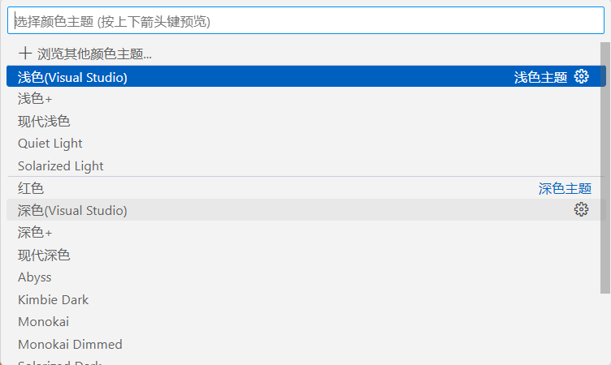

### 三、VS Code插件安装

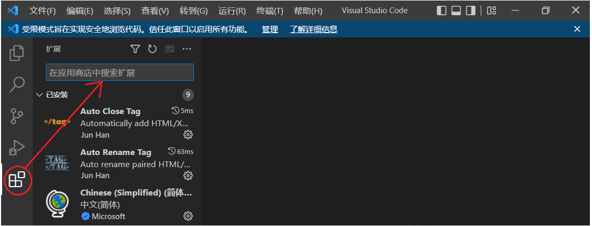 

VS Code提供了非常丰富的插件功能，根据你的需要，安装对应的插件可以大大提高开发效率。

完成前端开发，常见插件介绍：

#### 1、Chinese (Simplified) Language Pack

适用于 VS Code 的中文（简体）语言包

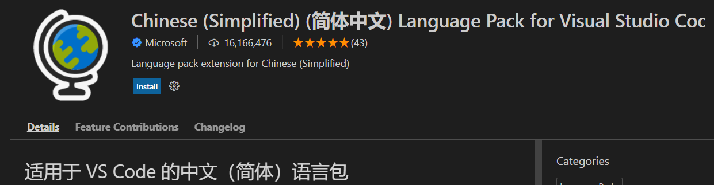 

#### 2、HTML CSS Support

在编写样式表的时候，自动补全功能大大缩减了编写时间。

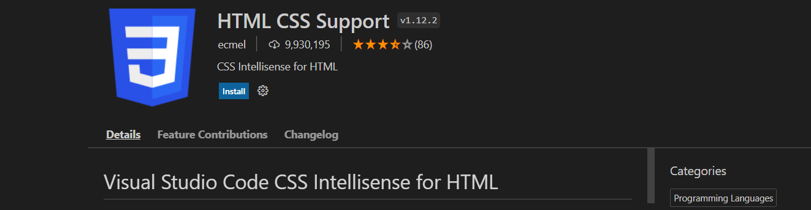 

#### 3、JavaScript (ES6) code snippets

支持ES6语法提示

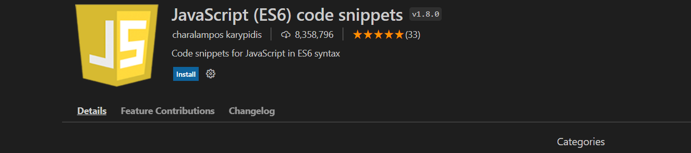 

#### 4、Mithril Emmet

一个能大幅度提高前端开发效率的一个工具，用于补全代码

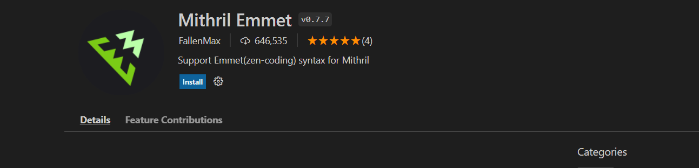 

#### 5、Path Intellisense

路径提示插件

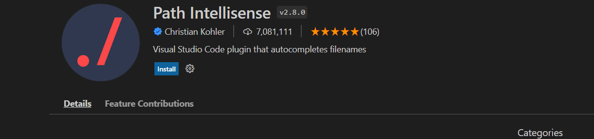 

#### 6、Vue 3 Snippets

在 Vue 2 或者 Vue 3 开发中提供代码片段，语法高亮和格式化的 VS Code 插件，能极大提高你的开发效率。

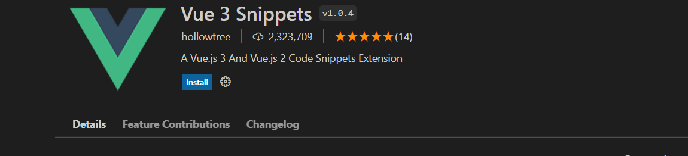 

#### 7、Auto Close Tag

自动闭合HTML/XML标签

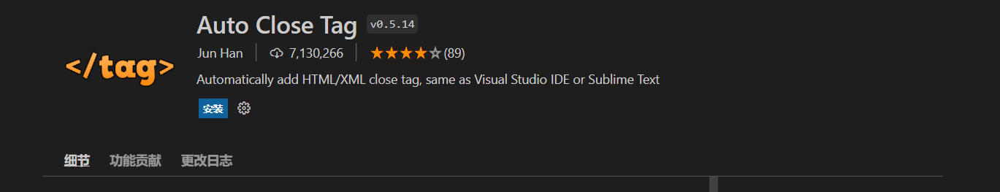 

#### 8、Auto Rename Tag

自动完成另一侧标签的同步修改

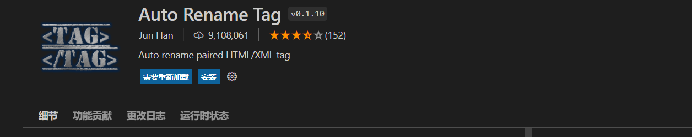 

#### 9、open in browser

vscode不像IDE一样能够直接在浏览器中打开html，而该插件支持快捷键与鼠标右键快速在浏览器中打开html文件，支持自定义打开指定的浏览器，包括：Firefox，Chrome，Opera，IE以及Safari

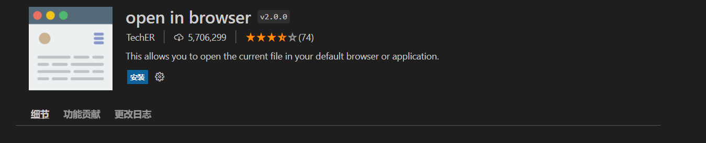 

#### 10、Live Server

一个具有实时加载功能的小型服务器，也就是说我们可以在项目中实时用live-server作为一个实时服务器实时查看开发的网页或项目效果。

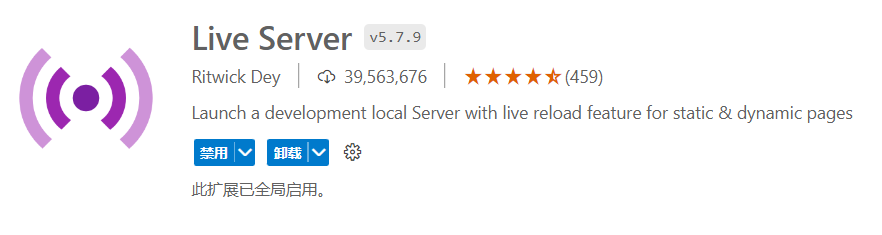

#### 11、Vue Language Features (Volar)

一个专门为 Vue 3 构建的语言支持插件。它基于@vue/reactivity按需计算一切，实现原生 TypeScript 语言服务级别的性能。 

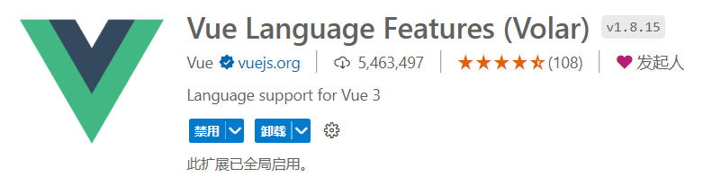

#### 12、TypeScript Vue Plugin (Volar)

TypeScript Vue Plugin是一个对Vue.js框架进行扩展的插件，它允许开发者使用TypeScript语言编写Vue组件和应用程序，并提供了更好的类型检查和编辑器支持。通过使用TypeScript Vue Plugin，开发者可以在编写Vue应用时获得更好的开发体验和代码可维护性。

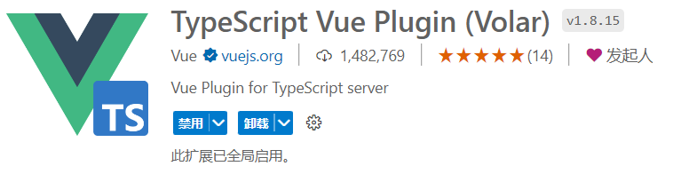 

#### 13、File Utils

File Utils插件,可以方便快捷的来创建、复制、移动、重命名文件和目录。 

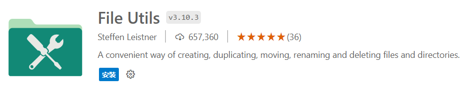

#### 14、IntelliJ IDEA Keybindings

安装VSCode的插件 IntelliJ IDEA Keybindings 即可在VSCode中使用IDEA的快捷键。

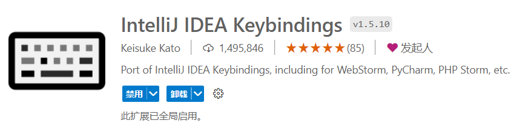 

### 四、VS Code 配置

打开配置面板，根据自己的喜好，可以修改字体、背景样式等偏好设置

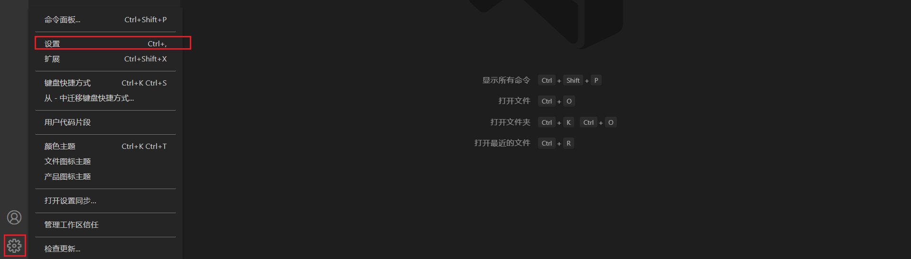

