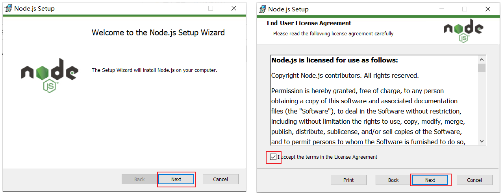
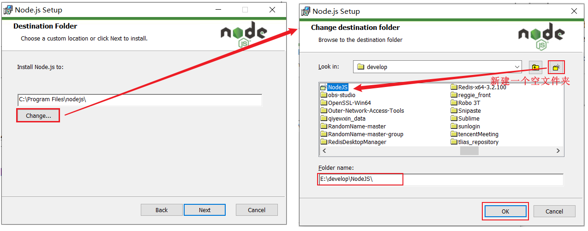
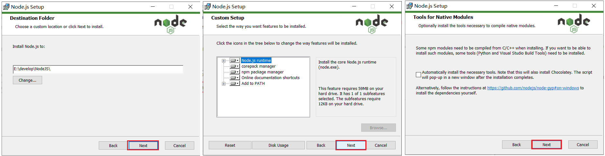
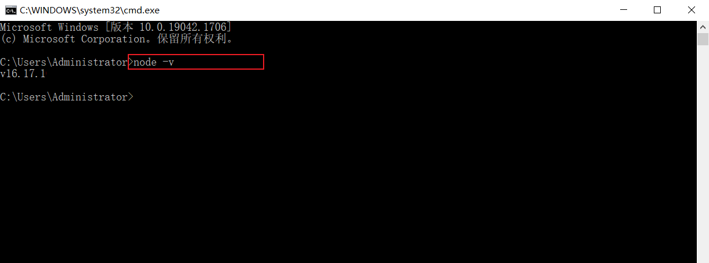
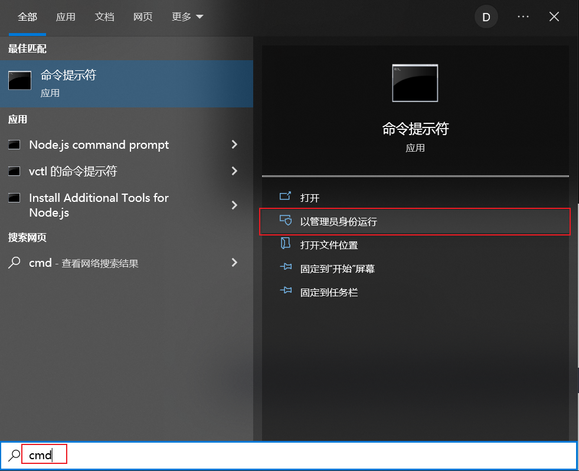

# NodeJS安装

## 1. 双击资料中提供的安装包 

  

  


## 2. 选择安装目录

选择安装到一个，没有中文，没有空格的目录下（新建一个文件夹NodeJS）

 

 


## 3. 验证NodeJS环境变量

NodeJS 安装完毕后，会自动配置好环境变量，我们验证一下是否安装成功，通过： node -v

  


## 4. 配置npm的全局安装路径

 


使用管理员身份运行命令行，在命令行中，执行如下指令：

```
npm config set prefix "D:\develop\NodeJS"
```

注意：D:\develop\NodeJS 这个目录是NodeJS的安装目录


## 5.更换安装包的源

**设置**

npm config set registry http://registry.npm.taobao.org/

**检查**

`npm config get registry`


