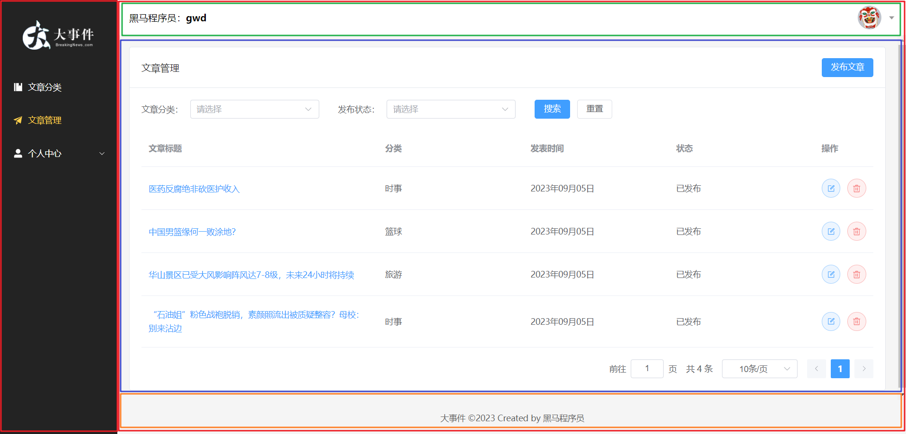

# 一、环境准备

### 1.1 创建vue工程(big-event)

```js
npm init vue@latest

cd big-event
npm install
```

### 1.2 安装插件

1. 安装element-plus

   ```js
   1.1 执行命令: npm install element-plus --save
   1.2 在main.js中做如下配置
   	import ElementPlus from 'element-plus'
   	import 'element-plus/dist/index.css'
   	app.use(ElementPlus)
   ```

2. 安装axios

   ```js
   npm install axios
   ```

   

3. 安装sass依赖

   ```js
   npm install sass -D
   ```

### 1.3 目录调整

1. 删除components目录下的内容

2. 删除App.vue中的内容，只保留script和template标签

3. 新建如下目录：

​	api：存放接口调用的js文件

​	utils：存放工具js文件

​		  拷贝request.js到util目录

​	views：存放页面的.vue文件

4. 删除assets目录中的内容， 将资料中的静态资源文件全部拷贝到该目录下

# 二、注册

### 2.1 页面搭建

```html
<script setup>
import { User, Lock } from '@element-plus/icons-vue'
import { ref } from 'vue'
//控制注册与登录表单的显示， 默认显示注册
const isRegister = ref(false)
</script>

<template>
    <el-row class="login-page">
        <el-col :span="12" class="bg"></el-col>
        <el-col :span="6" :offset="3" class="form">
            <!-- 注册表单 -->
            <el-form ref="form" size="large" autocomplete="off" v-if="isRegister">
                <el-form-item>
                    <h1>注册</h1>
                </el-form-item>
                <el-form-item>
                    <el-input :prefix-icon="User" placeholder="请输入用户名"></el-input>
                </el-form-item>
                <el-form-item>
                    <el-input :prefix-icon="Lock" type="password" placeholder="请输入密码"></el-input>
                </el-form-item>
                <el-form-item>
                    <el-input :prefix-icon="Lock" type="password" placeholder="请输入再次密码"></el-input>
                </el-form-item>
                <!-- 注册按钮 -->
                <el-form-item>
                    <el-button class="button" type="primary" auto-insert-space>
                        注册
                    </el-button>
                </el-form-item>
                <el-form-item class="flex">
                    <el-link type="info" :underline="false" @click="isRegister = false">
                        ← 返回
                    </el-link>
                </el-form-item>
            </el-form>
            <!-- 登录表单 -->
            <el-form ref="form" size="large" autocomplete="off" v-else>
                <el-form-item>
                    <h1>登录</h1>
                </el-form-item>
                <el-form-item>
                    <el-input :prefix-icon="User" placeholder="请输入用户名"></el-input>
                </el-form-item>
                <el-form-item>
                    <el-input name="password" :prefix-icon="Lock" type="password" placeholder="请输入密码"></el-input>
                </el-form-item>
                <el-form-item class="flex">
                    <div class="flex">
                        <el-checkbox>记住我</el-checkbox>
                        <el-link type="primary" :underline="false">忘记密码？</el-link>
                    </div>
                </el-form-item>
                <!-- 登录按钮 -->
                <el-form-item>
                    <el-button class="button" type="primary" auto-insert-space>登录</el-button>
                </el-form-item>
                <el-form-item class="flex">
                    <el-link type="info" :underline="false" @click="isRegister = true">
                        注册 →
                    </el-link>
                </el-form-item>
            </el-form>
        </el-col>
    </el-row>
</template>

<style lang="scss" scoped>
/* 样式 */
.login-page {
    height: 100vh;
    background-color: #fff;

    .bg {
        background: url('@/assets/logo2.png') no-repeat 60% center / 240px auto,
            url('@/assets/login_bg.jpg') no-repeat center / cover;
        border-radius: 0 20px 20px 0;
    }

    .form {
        display: flex;
        flex-direction: column;
        justify-content: center;
        user-select: none;

        .title {
            margin: 0 auto;
        }

        .button {
            width: 100%;
        }

        .flex {
            width: 100%;
            display: flex;
            justify-content: space-between;
        }
    }
}
</style>
```

### 2.2 页面数据绑定与事件绑定

#### 2.2.1 数据绑定

```js
//用于注册的数据模型
const registerData = ref({
    username: '',
    password: '',
    rePassword: ''
})
```

#### 2.2.2 表单校验

```js
//自定义确认密码的校验函数
const rePasswordValid = (rule, value, callback) => {
    if (value == null || value === '') {
        return callback(new Error('请再次确认密码'))
    }
    if (registerData.password !== value) {
        return callback(new Error('两次输入密码不一致'))
    }
}
//用于注册的表单校验模型
const registerDataRules = ref({
    username: [
        { required: true, message: '请输入用户名', trigger: 'blur' },
        { min: 5, max: 16, message: '用户名的长度必须为5~16位', trigger: 'blur' }
    ],
    password: [
        { required: true, message: '请输入密码', trigger: 'blur' },
        { min: 5, max: 16, message: '密码长度必须为5~16位', trigger: 'blur' }
    ],
    rePassword: [
        { validator: rePasswordValid, trigger: 'blur' }
    ]
})
```

#### 2.2.3 事件绑定

```js
//用于注册的事件函数
const register = () => {
    console.log('注册...');
}
```


### 2.3 接口调用

#### 2.3.1 在src/api/user.js中提供访问注册接口的函数

```js
//注册
export const registerService = (registerData) => {
    var params = new URLSearchParams()
    for (let key in registerData) {
        params.append(key, registerData[key])
    }
    return request.post('/user/register', params)
}
```

#### 2.3.2 在Login.vue中完成注册接口调用

```js
import { registerService} from '@/api/user.js'
//用于注册的事件函数
const register = async () => {
    //console.log('注册...');
    let result = await registerService(registerData.value);
    if (result.code == 0) {
        alert('注册成功!')
    } else {
        alert('注册失败!')
    }
}
```

### 2.4 处理跨域问题

由于发起ajax请求的域为http://localhost:5173, 而后台服务器的域为 http://localhost:8080, 所以浏览器会限制该请求的发送, 这种问题称为跨域问题, 跨域问题可以在服务器端解决,也可以在浏览器端解决, 咱们这一块通过配置代理的方式解决

**request.js中配置统一前缀 /api**

```js
//定制请求的实例

//导入axios  npm install axios
import axios from 'axios';
//定义一个变量,记录公共的前缀  ,  baseURL
const baseURL = '/api';
const instance = axios.create({baseURL})


//添加响应拦截器
instance.interceptors.response.use(
    result=>{
        return result.data;
    },
    err=>{
        alert('服务异常');
        return Promise.reject(err);//异步的状态转化成失败的状态
    }
)

export default instance;
```


**vie.config.js中配置代理**

```js
import { fileURLToPath, URL } from 'node:url'

import { defineConfig } from 'vite'
import vue from '@vitejs/plugin-vue'

// https://vitejs.dev/config/
export default defineConfig({
  plugins: [
    vue(),
  ],
  resolve: {
    alias: {
      '@': fileURLToPath(new URL('./src', import.meta.url))
    }
  },
  //配置代理
  server: {
    proxy: {
      '/api': {
        target: 'http://localhost:8080', // 后端服务器地址
        changeOrigin: true, // 是否改变请求域名
        rewrite: (path) => path.replace(/^\/api/, '')//将原有请求路径中的api替换为''
      }
    }
  }
})

```


# 三、登录

### 3.1页面数据绑定与事件绑定

#### 3.1.1 绑定数据

```js
//复用注册表单的数据模型
const registerData = ref({
    username: '',
    password: '',
    rePassword: ''
})
```

#### 3.1.2 每次点击注册或者登录，共用数据模型中的数据

```js
//清空数据模型的数据
const clearRegisterData = () => {
    registerData.value = {
        username: '',
        password: '',
        rePassword: ''
    }
}
```

#### 3.1.3 事件绑定

```js
const login =  () => {
    
}
```

### 3.2 接口调用

#### 3.2.1 在src/api/user.js中提供访问注册接口的函数

```js
//登录
export const loginService = (loginData)=>{
    var params = new URLSearchParams()
    for(let key in loginData){
        params.append(key,loginData[key])
    }
    return request.post('/user/login',params)
}
```

#### 3.2.2 在Login.vue中完成登录接口调用

```js
import { registerService, loginService } from '@/api/user.js'

//用于登录的事件函数
const login = async () => {
    let result = await loginService(registerData.value)
    if(result.code==0){
        alert('登录成功!')
    }else{
        alert('登录失败!')
    }
}
```

# 四、优化axios响应截器

在接口调用的API中，我们都需要对业务响应的状态进行判断，从而给用户对应的提示，这个工作不难，但是每个接口的调用，都这样写代码，显然是比较繁琐的，我们可以在axios的相应拦截器中，如果服务器响应成功了，统一判断后台返回的业务状态码code，如果成功了，正常返回数据，如果失败了，则给出用户对应的提示即可

**请求工具request.js**

```js
//添加响应拦截器
instance.interceptors.response.use(
    result => {
        //如果业务状态码为0，代表本次操作成功
        if (result.data.code == 0) {
            return result.data;
        }
        //代码走到这里，代表业务状态码不是0，本次操作失败
        alert(result.data.message || '服务异常');
        return Promise.reject(result.data);//异步的状态转化成失败的状态
    },
    err => {
        alert('服务异常');
        return Promise.reject(err);//异步的状态转化成失败的状态
    }
)
```

**接口调用user.js**

```js
//用于注册的事件函数
const register = async () => {
    //console.log('注册...');
    await registerService(registerData.value);
    alert('注册成功!')

}

//用于登录的事件函数
const login = async () => {
    await loginService(registerData.value)
    alert('登录成功!')
    
}
```


**Element-Plus提示框的使用**

```js
import { ElMessage } from 'element-plus'

ElMessage.error('服务异常');
ElMessage.success('登录成功!')
```


# 五、主页面布局




```html
<script setup>
import {
    Management,
    Promotion,
    UserFilled,
    User,
    Crop,
    EditPen,
    SwitchButton,
    CaretBottom
} from '@element-plus/icons-vue'
import avatar from '@/assets/default.png'
</script>

<template>
    <el-container class="layout-container">
        <!-- 左侧菜单 -->
        <el-aside width="200px">
            <div class="el-aside__logo"></div>
            <el-menu active-text-color="#ffd04b" background-color="#232323"  text-color="#fff"
                router>
                <el-menu-item >
                    <el-icon>
                        <Management />
                    </el-icon>
                    <span>文章分类</span>
                </el-menu-item>
                <el-menu-item >
                    <el-icon>
                        <Promotion />
                    </el-icon>
                    <span>文章管理</span>
                </el-menu-item>
                <el-sub-menu >
                    <template #title>
                        <el-icon>
                            <UserFilled />
                        </el-icon>
                        <span>个人中心</span>
                    </template>
                    <el-menu-item >
                        <el-icon>
                            <User />
                        </el-icon>
                        <span>基本资料</span>
                    </el-menu-item>
                    <el-menu-item >
                        <el-icon>
                            <Crop />
                        </el-icon>
                        <span>更换头像</span>
                    </el-menu-item>
                    <el-menu-item >
                        <el-icon>
                            <EditPen />
                        </el-icon>
                        <span>重置密码</span>
                    </el-menu-item>
                </el-sub-menu>
            </el-menu>
        </el-aside>
        <!-- 右侧主区域 -->
        <el-container>
            <!-- 头部区域 -->
            <el-header>
                <div>黑马程序员：<strong>东哥</strong></div>
                <el-dropdown placement="bottom-end">
                    <span class="el-dropdown__box">
                        <el-avatar :src="avatar" />
                        <el-icon>
                            <CaretBottom />
                        </el-icon>
                    </span>
                    <template #dropdown>
                        <el-dropdown-menu>
                            <el-dropdown-item command="profile" :icon="User">基本资料</el-dropdown-item>
                            <el-dropdown-item command="avatar" :icon="Crop">更换头像</el-dropdown-item>
                            <el-dropdown-item command="password" :icon="EditPen">重置密码</el-dropdown-item>
                            <el-dropdown-item command="logout" :icon="SwitchButton">退出登录</el-dropdown-item>
                        </el-dropdown-menu>
                    </template>
                </el-dropdown>
            </el-header>
            <!-- 中间区域 -->
            <el-main>
                <div style="width: 1290px; height: 570px;border: 1px solid red;">
                    内容展示区
                </div>
            </el-main>
            <!-- 底部区域 -->
            <el-footer>大事件 ©2023 Created by 黑马程序员</el-footer>
        </el-container>
    </el-container>
</template>

<style lang="scss" scoped>
.layout-container {
    height: 100vh;

    .el-aside {
        background-color: #232323;

        &__logo {
            height: 120px;
            background: url('@/assets/logo.png') no-repeat center / 120px auto;
        }

        .el-menu {
            border-right: none;
        }
    }

    .el-header {
        background-color: #fff;
        display: flex;
        align-items: center;
        justify-content: space-between;

        .el-dropdown__box {
            display: flex;
            align-items: center;

            .el-icon {
                color: #999;
                margin-left: 10px;
            }

            &:active,
            &:focus {
                outline: none;
            }
        }
    }

    .el-footer {
        display: flex;
        align-items: center;
        justify-content: center;
        font-size: 14px;
        color: #666;
    }
}
</style>
```


# 六、路由

在App.vue中，不能同时展示Login.vue和Layout.vue，实际的需求是用户第一次访问程序，先展示登录页面，当用户登录成功后，再展示主页面，如果要达成这个需求，需要用到vue提供的路由相关的知识

路由，从起点到终点时，决定从起点到终点的路径的进程，在前端工程中，路由指的是根据不同的访问路径，展示不同组件的内容。Vue Router是Vue.js的官方路由，它与Vue.js深度集成，让Vue.js构建单页面应用变得更加轻而易举


### 6.1安装路由

```js
npm install vue-router@4
```


### 6.2创建路由器，并导出

在src/router目录下，定义一个js文件，起名为index.js。这样名字的js文件在导入时，可以不写文件名，只要定位到文件所在的文件夹即可，使用起来很方便

```js
//导入vue-router
import { createRouter, createWebHistory } from 'vue-router'
//导入组件
import LoginVue from '@/views/Login.vue'
import LayoutVue from '@/views/Layout.vue'

//定义路由关系
const routes = [
    { path: '/login', component: LoginVue },
    { path: '/', component: LayoutVue }
]

//创建路由器
const router = createRouter({
    history: createWebHistory(),
    routes: routes
});

export default router
```


### 6.3在vue应用实例中使用router

在main.js中导入创建应用实力的js文件，并调用实例的use方法使用路由器

```js
import router from '@/router'

app.use(router)
```


### 6.4定义展示路由组件的地方

在App.vue文件的template标签中，定义router-view标签

```html
<template>
   <router-view></router-view>
</template>
```

将来不管根据路由匹配到的组件内容，会在router-view标签内进行展示


### 6.5 测试

在浏览器地址栏分别访问：http://localhost:5173/    和   http://localhost:5173/login


### 6.6 路由API

在登录成功后，需要通过代码的方式将页面切换到首页，此时就需要调用路由器相关的API

**获取路由器**

```js
import { useRouter } from 'vue-router'
const router = useRouter();
```

**调用API**

```js
router.push('/')
```


# 七、子路由

在咱们的主页面中，当用户点击左侧的菜单时，右侧主区域的内容需要发生变化，将来每切换一个菜单，右侧需要加载对应组件的内容进行展示，像这样的场景咱们也需要使用路由来完成

由于这些组件都需要在Layout.vue中展示， 而Layout.vue本身已经参与了路由，因此我们需要在Layout.vue中通过子路由的方式来完成组件的切换

### 7.1提供菜单对应的组件

可以复制资料中的文件，也可以自己创建：

- ArticleCategory.vue
- ArticleManage.vue
- UserInfo.vue
- UserAvatar.vue
- UserResetPassword.vue


### 7.2配置子路由

在src/router/index.js中配置子路由

```js
//定义路由关系
const routes = [
    { path: '/login', component: LoginVue },
    {
        path: '/',
        component: LayoutVue,
        //重定向
        redirect: '/article/manage',
        //子路由
        children: [
            { path: '/article/category', component: ArticleCategoryVue },
            { path: '/article/manage', component: ArticleManageVue },
            { path: '/user/info', component: UserInfoVue },
            { path: '/user/avatar', component: UserAvatarVUe },
            { path: '/user/password', component: UserResetPasswordVue },
        ]
    }
]
```


### 7.3 在Layout.vue组件的右侧中间区域，添加router-view标签

```html
<!-- 中间区域 -->
<el-main>
    <div style="width: 1290px; height: 570px;border: 1px solid red;">
        <router-view></router-view>
    </div>
</el-main>
```


### 7.4 菜单项设置点击后跳转的路由路径

el-menu-item 标签的index属性可以设置点击后的路由路径

```html
<el-menu-item index="/article/category">
    <el-icon>
        <Management />
    </el-icon>
    <span>文章分类</span>
</el-menu-item>
```


# 八、文章分类列表

### 8.1 文章分类组件

```html
<script setup>
import {
    Edit,
    Delete
} from '@element-plus/icons-vue'
import { ref } from 'vue'
const categorys = ref([
    {
        "id": 3,
        "categoryName": "美食",
        "categoryAlias": "my",
        "createTime": "2023-09-02 12:06:59",
        "updateTime": "2023-09-02 12:06:59"
    },
    {
        "id": 4,
        "categoryName": "娱乐",
        "categoryAlias": "yl",
        "createTime": "2023-09-02 12:08:16",
        "updateTime": "2023-09-02 12:08:16"
    },
    {
        "id": 5,
        "categoryName": "军事",
        "categoryAlias": "js",
        "createTime": "2023-09-02 12:08:33",
        "updateTime": "2023-09-02 12:08:33"
    }
])
</script>
<template>
    <el-card class="page-container">
        <template #header>
            <div class="header">
                <span>文章分类</span>
                <div class="extra">
                    <el-button type="primary">添加分类</el-button>
                </div>
            </div>
        </template>
        <el-table :data="categorys" style="width: 100%">
            <el-table-column label="序号" width="100" type="index"> </el-table-column>
            <el-table-column label="分类名称" prop="categoryName"></el-table-column>
            <el-table-column label="分类别名" prop="categoryAlias"></el-table-column>
            <el-table-column label="操作" width="100">
                <template #default="{ row }">
                    <el-button :icon="Edit" circle plain type="primary" ></el-button>
                    <el-button :icon="Delete" circle plain type="danger"></el-button>
                </template>
            </el-table-column>
            <template #empty>
                <el-empty description="没有数据" />
            </template>
        </el-table>
    </el-card>
</template>

<style lang="scss" scoped>
.page-container {
    min-height: 100%;
    box-sizing: border-box;

    .header {
        display: flex;
        align-items: center;
        justify-content: space-between;
    }
}
</style>
```

### 8.2 列表接口调用

src/api/article.js

```js
//导入请求工具类
import request from '@/utils/request.js'

//文章分类列表查询
export const articleCategoryListService = ()=>{
    return request.get('/category')
}
```

ArticleCategory.vue

```js
//获取所有文章分类数据
import { articleCategoryListService } from '@/api/article.js'
const getAllCategory = async () => {
    let result = await articleCategoryListService();
    categorys.value = result.data;
}
getAllCategory();
```


但是上述的代码并不能真正的获取到所有文章分类数据，服务器响应状态码为401，因为目前请求头中并没有携带token


# 九、Pinia状态管理库

Pinia是Vue的专属状态管理库，它允许你跨组件或页面共享状态

### 9.1安装

```js
npm install pinia
```

### 9.2使用Pinia

在main.js中，引入pinia，创建pinia实例，并调用vue应用实例的use方法使用pinia

```js
import { createPinia } from 'pinia'

const pinia = createPinia()
app.use(pinia)
```

### 9.3 定义Store

在src/stores目录下定义token.js

```js
import { defineStore } from "pinia";
import {ref} from 'vue';

/*
    defineStore参数描述：
        第一个参数：给状态起名，具有唯一性
        第二个参数：函数，可以把定义该状态中拥有的内容

    defineStore返回值描述：
        返回的是一个函数，将来可以调用该函数，得到第二个参数中返回的内容
*/
export const useTokenStore = defineStore('token',()=>{
    //1.定义描述token
    const token = ref('')

    //2.定义修改token的方法
    const setToken = (newToken)=>{
        token.value = newToken
    }

    //3.定义移除token的方法
    const removeToken = ()=>{
        token.value=''
    }
    return {
        token,setToken,removeToken
    }
})
```

### 9.4 使用Store

在需要使用状态的地方，导入@/stores/*.js , 使用即可

在Login.vue中导入@/stores/token.js, 并且当用户登录成功后，将token保存pinia中

```js
//导入token状态
import { useTokenStore } from '@/stores/token.js'

//调用useTokenStore得到状态
const tokenStore = useTokenStore();

//用于登录的事件函数
const login = async () => {
    let result = await loginService(registerData.value)
    //保存token
    tokenStore.setToken(result.data)
    
    ElMessage.success('登录成功!')
    router.push('/')
}
```


在article.js中导入@/stores/token.js, 从pinia中获取到存储的token，在发起查询文章分类列表的时候把token通过请求头的形式携带给服务器

```js
//导入@/stores/token.js
import { useTokenStore } from '../stores/token'


//文章分类列表查询
export const articleCategoryListService = () => {
    //获取token状态
    const tokenStore = useTokenStore()
    //通过请求头Authorization携带token
    return request.get('/category', { headers: { 'Authorization': tokenStore.token } })
}
```


# 十、axios请求拦截器

当进入主页后，将来要与后台交互，都需要携带token，如果每次请求都写这样的代码，将会比较繁琐，此时可以将携带token的代码通过请求拦截器统一处理

在 src/util/request.js中

```js
//导入token状态
import { useTokenStore } from '@/stores/token.js';
//添加请求拦截器
instance.interceptors.request.use(
    (config)=>{
        //在发送请求之前做什么
        let tokenStore = useTokenStore()
        //如果token中有值，在携带
        if(tokenStore.token){
            config.headers.Authorization=tokenStore.token
        }
        return config
    },
    (err)=>{
        //如果请求错误做什么
        Promise.reject(err)
    }
)
```


# 十一、Pinia持久化插件

默认情况下，由于pinia是内存存储，当你刷新页面的时候pinia中的数据会丢失，可以借助于persist插件解决这个问题，persist插件支持将pinia中的数据持久化到sessionStorage和localStorage中

### 11.1 安装persist插件

```js
npm install pinia-persistedstate-plugin
```


### 11.2 pinia中使用persist插件

在main.js中

```js
import { createPinia } from 'pinia'
//导入持久化插件
import {createPersistedState} from'pinia-persistedstate-plugin'
const pinia = createPinia()
const persist = createPersistedState()
//pinia使用持久化插件
pinia.use(persist)
app.use(pinia)
```


### 11.3 在创建定义状态是配置持久化

在src/stores/token.js中

```js
export const useTokenStore = defineStore('token',()=>{
    //1.定义描述token
    const token = ref('')

    //2.定义修改token的方法
    const setToken = (newToken)=>{
        token.value = newToken
    }

    //3.定义移除token的方法
    const removeToken = ()=>{
        token.value=''
    }
    return {
        token,setToken,removeToken
    }
}
,
//参数持久化
{
    persist:true
}
)
```


# 十二、未登录统一处理

在后续访问接口时，如果没有登录，则前端不携带token，后台服务器会返回响应状态码401，代表未登录，此时可以在axios的响应拦截器中，统一对未登录的情况做处理

**request.js**

```js
import router from '@/router'


//添加响应拦截器
instance.interceptors.response.use(
    result => {
        //如果业务状态码为0，代表本次操作成功
        if (result.data.code == 0) {
            return result.data;
        }
        //代码走到这里，代表业务状态码不是0，本次操作失败
        ElMessage.error(result.data.message || '服务异常');
        return Promise.reject(result.data);//异步的状态转化成失败的状态
    },
    err => {
        //如果响应状态码时401，代表未登录，给出对应的提示，并跳转到登录页
        if(err.response.status===401){
            ElMessage.error('请先登录！')
            router.push('/login')
        }else{
            ElMessage.error('服务异常');
        }
        return Promise.reject(err);//异步的状态转化成失败的状态
    }
)
```


# 十三、添加文章分类

### 13.1 添加分类弹窗页面

```html
<!-- 添加分类弹窗 -->
<el-dialog v-model="dialogVisible" title="添加弹层" width="30%">
    <el-form :model="categoryModel" :rules="rules" label-width="100px" style="padding-right: 30px">
        <el-form-item label="分类名称" prop="categoryName">
            <el-input v-model="categoryModel.categoryName" minlength="1" maxlength="10"></el-input>
        </el-form-item>
        <el-form-item label="分类别名" prop="categoryAlias">
            <el-input v-model="categoryModel.categoryAlias" minlength="1" maxlength="15"></el-input>
        </el-form-item>
    </el-form>
    <template #footer>
        <span class="dialog-footer">
            <el-button @click="dialogVisible = false">取消</el-button>
            <el-button type="primary"> 确认 </el-button>
        </span>
    </template>
</el-dialog>
```

### 13.2 数据模型和校验规则

```js
//控制添加分类弹窗
const dialogVisible = ref(false)

//添加分类数据模型
const categoryModel = ref({
    categoryName: '',
    categoryAlias: ''
})
//添加分类表单校验
const rules = {
    categoryName: [
        { required: true, message: '请输入分类名称', trigger: 'blur' },
    ],
    categoryAlias: [
        { required: true, message: '请输入分类别名', trigger: 'blur' },
    ]
}
```

### 13.3 添加分类按钮单击事件

```html
 <el-button type="primary" @click="dialogVisible = true">添加分类</el-button>
```

### 13.4 接口调用

**在article.js中提供添加分类的函数**

```js
//添加文章分类
export const articleCategoryAddService = (categoryModel) => {
    return request.post('/category', categoryModel)
}
```

**在页面中调用接口**

```js
//访问后台，添加文章分类
const addCategory = async ()=>{
    let result = await articleCategoryAddService(categoryModel.value);
    ElMessage.success(result.message? result.message:'添加成功')
    //隐藏弹窗
    dialogVisible.value = false
    //再次访问后台接口，查询所有分类
    getAllCategory()
}
```

```html
<el-button type="primary" @click="addCategory"> 确认 </el-button>
```


# 十四、修改文章分类

### 14.1 修改分类弹窗页面

修改分类弹窗和新增文章分类弹窗长的一样，所以可以服用添加分类的弹窗

**弹窗标题显示**
定义标题

```js
//弹窗标题
const title=ref('')
```

在弹窗上绑定标题

```html
 <el-dialog v-model="dialogVisible" :title="title" width="30%">
```

为添加分类按钮绑定事件

```html
<el-button type="primary" @click="title='添加分类';dialogVisible = true">添加分类</el-button>
```

为修改分类按钮绑定事件

```html
<el-button :icon="Edit" circle plain type="primary" @click="title='修改分类';dialogVisible=true"></el-button>
```


### 14.2 数据回显

当点击修改分类按钮时，需要把当前这一条数据的详细信息显示到修改分类的弹窗上，这个叫回显

**通过插槽的方式得到被点击按钮所在行的数据**

```html
<template #default="{ row }">
                    <el-button :icon="Edit" circle plain type="primary" @click="updateCategoryEcho(row)"></el-button>
                    <el-button :icon="Delete" circle plain type="danger"></el-button>
                </template>
```

**回显函数**

```js
//修改分类回显
const updateCategoryEcho = (row) => {
    title.value = '修改分类'
    dialogVisible.value = true
    //将row中的数据赋值给categoryModel
    categoryModel.value.categoryName=row.categoryName
    categoryModel.value.categoryAlias=row.categoryAlias
    //修改的时候必须传递分类的id，所以扩展一个id属性
    categoryModel.value.id=row.id
}
```


### 14.3 接口调用

**article.js中提供修改分类的函数**

```js
//修改分类
export const articleCategoryUpdateService = (categoryModel)=>{
    return request.put('/category',categoryModel)
}
```

**修改确定按钮的绑定事件**

```html
 <span class="dialog-footer">
                <el-button @click="dialogVisible = false">取消</el-button>
                <el-button type="primary" @click="title==='添加分类'? addCategory():updateCategory()"> 确认 </el-button>
            </span>
```

**调用接口完成修改的函数**

```js
//修改分类
const updateCategory=async ()=>{
    let result = await articleCategoryUpdateService(categoryModel.value)
    ElMessage.success(result.message? result.message:'修改成功')
    //隐藏弹窗
    dialogVisible.value=false
    //再次访问后台接口，查询所有分类
    getAllCategory()
}
```


由于现在修改和新增共用了一个数据模型，所以在点击添加分类后，有时候会显示数据，此时可以将categoryModel中的数据清空

```js
//清空模型数据
const clearCategoryModel = ()=>{
    categoryModel.value.categoryName='',
    categoryModel.value.categoryAlias=''
}
```


修改添加按钮的点击事件

```html
 <el-button type="primary" @click="title = '添加分类'; dialogVisible = true;clearCategoryModel()">添加分类</el-button>
```


# 十五、删除分类（后台需要补齐）

### 15.1 确认框

```js
//删除分类  给删除按钮绑定事件
const deleteCategory = (row) => {
    ElMessageBox.confirm(
        '你确认删除该分类信息吗？',
        '温馨提示',
        {
            confirmButtonText: '确认',
            cancelButtonText: '取消',
            type: 'warning',
        }
    )
        .then(() => {
            //用户点击了确认
            ElMessage({
                type: 'success',
                message: '删除成功',
            })
        })
        .catch(() => {
            //用户点击了取消
            ElMessage({
                type: 'info',
                message: '取消删除',
            })
        })
}
```


### 15.2 接口调用

**article.js中提供删除分类的函数**

```js

//删除分类
export const articleCategoryDeleteService = (id) => {
    return request.delete('/category?id='+id)
}
```

**当用户点击确认后，调用接口删除分类**

```js
//删除分类
const deleteCategory = (row) => {
    ElMessageBox.confirm(
        '你确认删除该分类信息吗？',
        '温馨提示',
        {
            confirmButtonText: '确认',
            cancelButtonText: '取消',
            type: 'warning',
        }
    )
        .then(async () => {
            //用户点击了确认
            let result = await articleCategoryDeleteService(row.id)
            ElMessage.success(result.message?result.message:'删除成功')
            //再次调用getAllCategory，获取所有文章分类
            getAllCategory()
        })
        .catch(() => {
            //用户点击了取消
            ElMessage({
                type: 'info',
                message: '取消删除',
            })
        })
}
```


# 十六、文章列表

### 16.1 文章列表页面组件

```html
<script setup>
import {
    Edit,
    Delete
} from '@element-plus/icons-vue'

import { ref } from 'vue'

//文章分类数据模型
const categorys = ref([
    {
        "id": 3,
        "categoryName": "美食",
        "categoryAlias": "my",
        "createTime": "2023-09-02 12:06:59",
        "updateTime": "2023-09-02 12:06:59"
    },
    {
        "id": 4,
        "categoryName": "娱乐",
        "categoryAlias": "yl",
        "createTime": "2023-09-02 12:08:16",
        "updateTime": "2023-09-02 12:08:16"
    },
    {
        "id": 5,
        "categoryName": "军事",
        "categoryAlias": "js",
        "createTime": "2023-09-02 12:08:33",
        "updateTime": "2023-09-02 12:08:33"
    }
])

//用户搜索时选中的分类id
const categoryId=ref('')

//用户搜索时选中的发布状态
const state=ref('')

//文章列表数据模型
const articles = ref([
    {
        "id": 5,
        "title": "陕西旅游攻略",
        "content": "兵马俑,华清池,法门寺,华山...爱去哪去哪...",
        "coverImg": "https://big-event-gwd.oss-cn-beijing.aliyuncs.com/9bf1cf5b-1420-4c1b-91ad-e0f4631cbed4.png",
        "state": "草稿",
        "categoryId": 2,
        "createTime": "2023-09-03 11:55:30",
        "updateTime": "2023-09-03 11:55:30"
    },
    {
        "id": 5,
        "title": "陕西旅游攻略",
        "content": "兵马俑,华清池,法门寺,华山...爱去哪去哪...",
        "coverImg": "https://big-event-gwd.oss-cn-beijing.aliyuncs.com/9bf1cf5b-1420-4c1b-91ad-e0f4631cbed4.png",
        "state": "草稿",
        "categoryId": 2,
        "createTime": "2023-09-03 11:55:30",
        "updateTime": "2023-09-03 11:55:30"
    },
    {
        "id": 5,
        "title": "陕西旅游攻略",
        "content": "兵马俑,华清池,法门寺,华山...爱去哪去哪...",
        "coverImg": "https://big-event-gwd.oss-cn-beijing.aliyuncs.com/9bf1cf5b-1420-4c1b-91ad-e0f4631cbed4.png",
        "state": "草稿",
        "categoryId": 2,
        "createTime": "2023-09-03 11:55:30",
        "updateTime": "2023-09-03 11:55:30"
    },
])

//分页条数据模型
const pageNum = ref(1)//当前页
const total = ref(20)//总条数
const pageSize = ref(3)//每页条数

//当每页条数发生了变化，调用此函数
const onSizeChange = (size) => {
    pageSize.value = size
}
//当前页码发生变化，调用此函数
const onCurrentChange = (num) => {
    pageNum.value = num
}
</script>
<template>
    <el-card class="page-container">
        <template #header>
            <div class="header">
                <span>文章管理</span>
                <div class="extra">
                    <el-button type="primary">添加文章</el-button>
                </div>
            </div>
        </template>
        <!-- 搜索表单 -->
        <el-form inline>
            <el-form-item label="文章分类：">
                <el-select placeholder="请选择" v-model="categoryId">
                    <el-option 
                        v-for="c in categorys" 
                        :key="c.id" 
                        :label="c.categoryName"
                        :value="c.id">
                    </el-option>
                </el-select>
            </el-form-item>

            <el-form-item label="发布状态：">
                <el-select placeholder="请选择" v-model="state">
                    <el-option label="已发布" value="已发布"></el-option>
                    <el-option label="草稿" value="草稿"></el-option>
                </el-select>
            </el-form-item>
            <el-form-item>
                <el-button type="primary">搜索</el-button>
                <el-button>重置</el-button>
            </el-form-item>
        </el-form>
        <!-- 文章列表 -->
        <el-table :data="articles" style="width: 100%">
            <el-table-column label="文章标题" width="400" prop="title"></el-table-column>
            <el-table-column label="分类" prop="categoryId"></el-table-column>
            <el-table-column label="发表时间" prop="createTime"> </el-table-column>
            <el-table-column label="状态" prop="state"></el-table-column>
            <el-table-column label="操作" width="100">
                <template #default="{ row }">
                    <el-button :icon="Edit" circle plain type="primary"></el-button>
                    <el-button :icon="Delete" circle plain type="danger"></el-button>
                </template>
            </el-table-column>
            <template #empty>
                <el-empty description="没有数据" />
            </template>
        </el-table>
        <!-- 分页条 -->
        <el-pagination v-model:current-page="pageNum" v-model:page-size="pageSize" :page-sizes="[3, 5 ,10, 15]"
            layout="jumper, total, sizes, prev, pager, next" background :total="total" @size-change="onSizeChange"
            @current-change="onCurrentChange" style="margin-top: 20px; justify-content: flex-end" />
    </el-card>
</template>
<style lang="scss" scoped>
.page-container {
    min-height: 100%;
    box-sizing: border-box;

    .header {
        display: flex;
        align-items: center;
        justify-content: space-between;
    }
}
</style>
```


使用中文语言包，解决分页条中文问题, 在main.js中完成

```js
import locale from 'element-plus/dist/locale/zh-cn.js'

app.use(ElementPlus,{locale})
```

### 16.2、文章分类数据回显

**ArticleMange.vue**

```js
//文章列表查询
import { articleCategoryListService } from '@/api/article.js'
const getArticleCategoryList = async () => {
    //获取所有分类
    let resultC = await articleCategoryListService();
    categorys.value = resultC.data
}
getArticleCategoryList();
```

# 

# 十七、 文章列表接口调用

**article.js中提供获取文章列表数据的函数**

```js
//文章列表查询
export const articleListService = (params) => {
    return request.get('/article', { params: params })
}
```

**ArticleManage.vue中，调用接口获取数据**

```js
//文章列表查询
import { articleListService } from '@/api/article.js'
const getArticles = async () => {
    let params = {
        pageNum: pageNum.value,
        pageSize: pageSize.value,
        categoryId: categoryId.value ? categoryId.value : null,
        state: state.value ? state.value : null
    }
    let result = await articleListService(params);
    //渲染列表数据
    articles.value = result.data.items
    //为列表中添加categoryName属性
    for(let i=0;i<articles.value.length;i++){
        let article = articles.value[i];
        for(let j=0;j<categorys.value.length;j++){
            if(article.categoryId===categorys.value[j].id){
                article.categoryName=categorys.value[j].categoryName
            }
        }
    }
    //渲染总条数
    total.value=result.data.total
}
getArticles()
```

**当分页条的当前页和每页条数发生变化，重新发送请求获取数据**

```js
//当每页条数发生了变化，调用此函数
const onSizeChange = (size) => {
    pageSize.value = size
    getArticles()
}
//当前页码发生变化，调用此函数
const onCurrentChange = (num) => {
    pageNum.value = num
    getArticles()
}

```


# 十八、搜索和重置

为搜索按钮绑定单击事件，调用getArticles函数即可

```html
<el-button type="primary" @click="getArticles">搜索</el-button>
```

为重置按钮绑定单击事件，清除categoryId和state的之即可

```html
 <el-button @click="categoryId='';state=''">重置</el-button>
```


# 十九、添加文章

### 19.1 添加文章抽屉组件

```js
import {Plus} from '@element-plus/icons-vue'
//控制抽屉是否显示
const visibleDrawer = ref(false)
//添加表单数据模型
const articleModel = ref({
    title: '',
    categoryId: '',
    coverImg: '',
    content:'',
    state:''
})
```

```html
<!-- 抽屉 -->
        <el-drawer v-model="visibleDrawer" title="添加文章" direction="rtl" size="50%">
            <!-- 添加文章表单 -->
            <el-form :model="articleModel" label-width="100px" >
                <el-form-item label="文章标题" >
                    <el-input v-model="articleModel.title" placeholder="请输入标题"></el-input>
                </el-form-item>
                <el-form-item label="文章分类">
                    <el-select placeholder="请选择" v-model="articleModel.categoryId">
                        <el-option v-for="c in categorys" :key="c.id" :label="c.categoryName" :value="c.id">
                        </el-option>
                    </el-select>
                </el-form-item>
                <el-form-item label="文章封面">

                    <el-upload class="avatar-uploader" :auto-upload="false" :show-file-list="false">
                        
                        <el-icon v-else class="avatar-uploader-icon">
                            <Plus />
                        </el-icon>
                    </el-upload>
                </el-form-item>
                <el-form-item label="文章内容">
                    <div class="editor">富文本编辑器</div>
                </el-form-item>
                <el-form-item>
                    <el-button type="primary">发布</el-button>
                    <el-button type="info">草稿</el-button>
                </el-form-item>
            </el-form>
        </el-drawer>
```

```css
/* 抽屉样式 */
.avatar-uploader {
    :deep() {
        .avatar {
            width: 178px;
            height: 178px;
            display: block;
        }

        .el-upload {
            border: 1px dashed var(--el-border-color);
            border-radius: 6px;
            cursor: pointer;
            position: relative;
            overflow: hidden;
            transition: var(--el-transition-duration-fast);
        }

        .el-upload:hover {
            border-color: var(--el-color-primary);
        }

        .el-icon.avatar-uploader-icon {
            font-size: 28px;
            color: #8c939d;
            width: 178px;
            height: 178px;
            text-align: center;
        }
    }
}
.editor {
  width: 100%;
  :deep(.ql-editor) {
    min-height: 200px;
  }
}
```


为添加文章按钮添加单击事件，展示抽屉

```html
<el-button type="primary" @click="visibleDrawer = true">添加文章</el-button>
```


### 19.2 富文本编辑器

文章内容需要使用到富文本编辑器，这里咱们使用一个开源的富文本编辑器 Quill

官网地址： https://vueup.github.io/vue-quill/

**安装：**

```js
npm install @vueup/vue-quill@latest --save
```

**导入组件和样式：**

```js
import { QuillEditor } from '@vueup/vue-quill'
import '@vueup/vue-quill/dist/vue-quill.snow.css'
```

**页面长使用quill组件：**

```html

<quill-editor
              theme="snow"
              v-model:content="articleModel.content"
              contentType="html"
              >
</quill-editor>

```

**样式美化：**

```css
.editor {
  width: 100%;
  :deep(.ql-editor) {
    min-height: 200px;
  }
}
```


### 19.3 文章封面图片上传

将来当点击+图标，选择本地图片后，el-upload这个组件会自动发送请求，把图片上传到指定的服务器上，而不需要我们自己使用axios发送异步请求，所以需要给el-upload标签添加一些属性，控制请求的发送

auto-upload:是否自动上传

action: 服务器接口路径

name: 上传的文件字段名

headers: 设置上传的请求头

on-success: 上传成功的回调函数


```html
import {
    Plus
} from '@element-plus/icons-vue'

<el-form-item label="文章封面">
    <el-upload class="avatar-uploader" 
               :show-file-list="false" 
               >
        
        <el-icon v-else class="avatar-uploader-icon">
            <Plus />
        </el-icon>
    </el-upload>
</el-form-item>
```

**注意：**

1. 由于这个请求时el-upload自动发送的异步请求，并没有使用咱们的request.js请求工具，所以在请求的路ing上，需要加上/api, 这个时候请求代理才能拦截到这个请求，转发到后台服务器上

2. 要携带请求头，还需要导入pinia状态才可以使用

   ```js
   import { useTokenStore } from '@/stores/token.js'
   const tokenStore = useTokenStore();
   ```

3. 在成功的回调函数中，可以拿到服务器响应的数据，其中有一个属性为data，对应的就是图片在阿里云oss上存储的访问地址，需要把它赋值给articleModel的coverImg属性，这样img标签就能显示这张图片了，因为img标签上通过src属性绑定了articleModel.coverImg

   ```js
   //上传图片成功回调
   const uploadSuccess = (img) => {
       //img就是后台响应的数据，格式为：{code:状态码，message：提示信息，data: 图片的存储地址}
       articleModel.value.coverImg=img.data
   }
   ```


### 19.4 添加文章接口调用

**article.js中提供添加文章函数**

```js
//添加文章
export const articleAddService = (articleModel)=>{
    return request.post('/article',articleModel)
}
```

**为已发布和草稿按钮绑定事件**

```html
<el-form-item>
    <el-button type="primary" @click="addArticle('已发布')">发布</el-button>
    <el-button type="info" @click="addArticle('草稿')">草稿</el-button>
</el-form-item>
```

**ArticleManage.vue中提供addArticle函数完成添加文章接口的调用**

```js
//添加文章
const addArticle=async (state)=>{
    articleModel.value.state = state
    let result = await articleAddService(articleModel.value);
    ElMessage.success(result.message? result.message:'添加成功')
    //再次调用getArticles,获取文章
    getArticles()
    //隐藏抽屉
    visibleDrawer.value=false
}
```


# 二十、顶部导航栏个人信息显示

在Layout.vue中，页面加载完就发送请求，获取个人信息展示，并存储到pinia中，因为将来在个人中心中修改信息的时候还需要使用

**user.js中提供获取个人信息的函数**

```js
//获取个人信息
export const userInfoGetService = ()=>{
    return request.get('/user/userInfo');
}
```

**src/stores/user.js中，定义个人中心状态**

```js
import { defineStore } from "pinia"
import {ref} from 'vue'

export const useUserInfoStore = defineStore('userInfo',()=>{
    //1.定义用户信息
    const info = ref({})
    //2.定义修改用户信息的方法
    const setInfo = (newInfo)=>{
        info.value = newInfo
    }
    //3.定义清空用户信息的方法
    const removeInfo = ()=>{
        info.value={}
    }

    return{info,setInfo,removeInfo}
},{
    persist:true
})
```


**Layout.vue中获取个人信息，并存储到pinia中**

```js
//导入接口函数
import {userInfoGetService} from '@/api/user.js'
//导入pinia
import {useUserInfoStore} from '@/stores/user.js'
const userInfoStore = useUserInfoStore();
import {ref} from 'vue'

//获取个人信息
const getUserInf = async ()=>{
    let result = await userInfoGetService();
    //存储pinia
    userInfoStore.info =result.data;
}
getUserInf()
```


**Layout.vue的顶部导航栏中，展示昵称和头像**

```html
<div>黑马程序员：<strong>{{ userInfoStore.info.nickname ? userInfoStore.info.nickname : userInfoStore.info.usrename }}</strong></div>


<el-avatar :src="userInfoStore.info.userPic ? userInfoStore.info.userPic : avatar" />
```


# 二十一、el-dropdown中功能实现

在el-dropdown中有四个子条目，分别是：

- 基本资料
- 更换头像
- 重置密码
- 退出登录

其中其三个起到路由功能，跟左侧菜单中【个人中心】下面的二级菜单是同样的功能，退出登录需要删除本地pinia中存储的token以及userInfo


**路由实现：**

在el-dropdown-item标签上添加command属性，属性值和路由表中/user/xxx保持一致

```html
<el-dropdown-menu>
    <el-dropdown-item command="info" :icon="User">基本资料</el-dropdown-item>
    <el-dropdown-item command="avatar" :icon="Crop">更换头像</el-dropdown-item>
    <el-dropdown-item command="password" :icon="EditPen">重置密码</el-dropdown-item>
    <el-dropdown-item command="logout" :icon="SwitchButton">退出登录</el-dropdown-item>
</el-dropdown-menu>
```

在el-dropdown标签上绑定command事件,当有条目被点击后，会触发这个事件

```html
<el-dropdown placement="bottom-end" @command="handleCommand">
```

提供handleCommand函数，参数为点击条目的command属性值

```js
//dropDown条目被点击后，回调的函数
import {useRouter} from 'vue-router'
const router = useRouter()
const handleCommand = (command)=>{
    if(command==='logout'){
        //退出登录
        alert('退出登录')
    }else{
        //路由
        router.push('/user/'+command)
    }
}
```


**退出登录实现：**

```js
import {ElMessage,ElMessageBox} from 'element-plus'
import { useTokenStore } from '@/stores/token.js'
const tokenStore = useTokenStore()
const handleCommand = (command) => {
    if (command === 'logout') {
        //退出登录
        ElMessageBox.confirm(
            '你确认退出登录码？',
            '温馨提示',
            {
                confirmButtonText: '确认',
                cancelButtonText: '取消',
                type: 'warning',
            }
        )
            .then(async () => {
                //用户点击了确认
                //清空pinia中的token和个人信息
                userInfoStore.info={}
                tokenStore.token=''
                //跳转到登录页
                router.push('/login')
            })
            .catch(() => {
                //用户点击了取消
                ElMessage({
                    type: 'info',
                    message: '取消退出',
                })
            })
    } else {
        //路由
        router.push('/user/' + command)
    }
}
```


# 二十二、基本资料修改

### 22.1 基本资料页面组件

```html
<script setup>
import { ref } from 'vue'
const userInfo = ref({
    id: 0,
    username: 'zhangsan',
    nickname: 'zs',
    email: 'zs@163.com',
})
const rules = {
    nickname: [
        { required: true, message: '请输入用户昵称', trigger: 'blur' },
        {
            pattern: /^\S{2,10}$/,
            message: '昵称必须是2-10位的非空字符串',
            trigger: 'blur'
        }
    ],
    email: [
        { required: true, message: '请输入用户邮箱', trigger: 'blur' },
        { type: 'email', message: '邮箱格式不正确', trigger: 'blur' }
    ]
}
</script>
<template>
    <el-card class="page-container">
        <template #header>
            <div class="header">
                <span>基本资料</span>
            </div>
        </template>
        <el-row>
            <el-col :span="12">
                <el-form :model="userInfo" :rules="rules" label-width="100px" size="large">
                    <el-form-item label="登录名称">
                        <el-input v-model="userInfo.username" disabled></el-input>
                    </el-form-item>
                    <el-form-item label="用户昵称" prop="nickname">
                        <el-input v-model="userInfo.nickname"></el-input>
                    </el-form-item>
                    <el-form-item label="用户邮箱" prop="email">
                        <el-input v-model="userInfo.email"></el-input>
                    </el-form-item>
                    <el-form-item>
                        <el-button type="primary">提交修改</el-button>
                    </el-form-item>
                </el-form>
            </el-col>
        </el-row>
    </el-card>
</template>
```


### 22.2 表单数据回显

个人信息之前已经存储到了pinia中，只需要从pinia中获取个人信息，替换模板数据即可

```js
import { useUserInfoStore } from '@/stores/user.js';
const userInfoStore = useUserInfoStore()
const userInfo = ref({...userInfoStore.info})
```


### 22.3 接口调用

在src/api/user.js中提供修改基本资料的函数

```js
//修改个人信息
export const userInfoUpdateService = (userInfo)=>{
    return request.put('/user/update',userInfo)
}
```

为修改按钮绑定单击事件

```html
  <el-button type="primary" @click="updateUserInfo">提交修改</el-button>
```

提供updateUserInfo函数

```js
//修改用户信息
import {userInfoUpdateService} from '@/api/user.js'
import { ElMessage } from 'element-plus';
const updateUserInfo = async ()=>{
    let result = await userInfoUpdateService(userInfo.value)
    ElMessage.success(result.message? result.message:'修改成功')
    //更新pinia中的数据
    userInfoStore.info.nickname=userInfo.value.nickname
    userInfoStore.info.email = userInfo.value.email
}
```


# 二十三、修改头像

### 23.1 修改头像页面组件

```html
<script setup>
import { Plus, Upload } from '@element-plus/icons-vue'
import {ref} from 'vue'
import avatar from '@/assets/default.png'
const uploadRef = ref()

//用户头像地址
const imgUrl= avatar

</script>

<template>
    <el-card class="page-container">
        <template #header>
            <div class="header">
                <span>更换头像</span>
            </div>
        </template>
        <el-row>
            <el-col :span="12">
                <el-upload 
                    ref="uploadRef"
                    class="avatar-uploader" 
                    :show-file-list="false"
                    >
                    
                    
                </el-upload>
                <br />
                <el-button type="primary" :icon="Plus" size="large"  @click="uploadRef.$el.querySelector('input').click()">
                    选择图片
                </el-button>
                <el-button type="success" :icon="Upload" size="large">
                    上传头像
                </el-button>
            </el-col>
        </el-row>
    </el-card>
</template>

<style lang="scss" scoped>
.avatar-uploader {
    :deep() {
        .avatar {
            width: 278px;
            height: 278px;
            display: block;
        }

        .el-upload {
            border: 1px dashed var(--el-border-color);
            border-radius: 6px;
            cursor: pointer;
            position: relative;
            overflow: hidden;
            transition: var(--el-transition-duration-fast);
        }

        .el-upload:hover {
            border-color: var(--el-color-primary);
        }

        .el-icon.avatar-uploader-icon {
            font-size: 28px;
            color: #8c939d;
            width: 278px;
            height: 278px;
            text-align: center;
        }
    }
}
</style>
```


### 23.2 头像回显

从pinia中读取用户的头像数据

```js
//读取用户信息
import {ref} from 'vue'
import {useUserInfoStore} from '@/stores/user.js'
const userInfoStore = useUserInfoStore()
const imgUrl=ref(userInfoStore.info.userPic)
```

img标签上绑定图片地址

```html


```


### 23.3 头像上传

为el-upload指定属性值，分别有：

- ​	action: 服务器接口路径
- ​	headers: 设置请求头，需要携带token
- ​	on-success: 上传成功的回调函数
- ​	name: 上传图片的字段名称


```html
<el-upload 
           class="avatar-uploader" 
           :show-file-list="false"
           :auto-upload="true"
           action="/api/upload"
           name="file"
           :headers="{'Authorization':tokenStore.token}"
           :on-success="uploadSuccess"
           >
    
    
</el-upload>
```


提供上传成功的回调函数

```js
//读取token信息
import {useTokenStore} from '@/stores/token.js'
const tokenStore = useTokenStore()

//图片上传成功的回调
const uploadSuccess = (result)=>{
    //回显图片
    imgUrl.value = result.data
}
```


外部触发图片选择

​	需要获取到el-upload组件，然后再通过$el.querySelector('input')获取到el-upload对应的元素，触发click事件

```html
//获取el-upload元素
const uploadRef = ref()


<el-button type="primary" :icon="Plus" size="large"  @click="uploadRef.$el.querySelector('input').click()">
    选择图片
</el-button>
```


### 24.4 接口调用

在user.js中提供修改头像的函数

```js
//修改头像
export const userAvatarUpdateService=(avatarUrl)=>{
    let params = new URLSearchParams();
    params.append('avatarUrl',avatarUrl)
    return request.patch('/user/updateAvatar',params)
}
```

为【上传头像】按钮绑定单击事件

```html
<el-button type="success" :icon="Upload" size="large" @click="updateAvatar">
    上传头像
</el-button>
```

提供updateAvatar函数，完成头像更新

```js
//调用接口，更新头像url
import {userAvatarUpdateService} from '@/api/user.js'
import {ElMessage} from 'element-plus'
const updateAvatar = async ()=>{
    let result = await userAvatarUpdateService(imgUrl.value)
    ElMessage.success(result.message? result.message:'修改成功')
    //更新pinia中的数据
    userInfoStore.info.userPic=imgUrl.value
}
```


